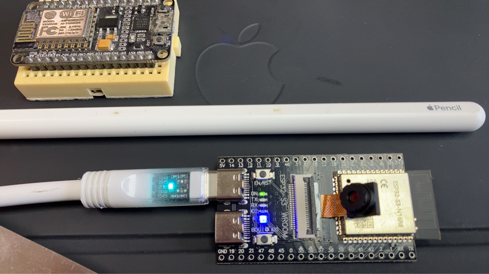

# 👁️ PROJECT HEIMDALL: IRON MAN MASK 3
### *The "God's Eye" Awakens*

**WARNING:** THIS IS A CLASSIFIED TEASER.
**HARDWARE:** ESP32-S3 WROOM (Dual Type-C) + OV2640 AI Vision Core
**TARGET:** Optical Flow & Visual Odometry for WIG-Craft

---

## 1. The Shadow over Reddit

While you are still debating if an ESP8266 can run PID loops...
And while you are shocked that we moved to Dual-Core ESP32 for flight control...

**We have already opened the Third Eye.**

Meet the **Iron Man Mask 3 (Project Heimdall)**:

This is not just a camera.
This is a **Visual Cortex** running on a $9 chip.

---

## 2. Why GPS is for Dinosaurs

You think autonomous flight requires GPS?
**Wrong.** GPS drifts. GPS is slow. GPS is blocked indoors.

We are implementing **Optical Flow** (the same tech inside your optical mouse, but for the sky).
* By tracking the texture of the water/ground 60 times per second...
* The WIG-Craft knows its **Velocity** and **Altitude** with millimeter precision.
* **Without GPS.** **Without Lidar.** Just pure Math & Vision.

---

## 3. The "Market Killer" Calculation

Let's do the math that will make drone manufacturers cry.
Here is the cost to achieve **Vision-Based Stability**:

| The "Industry Standard" Way | The Bangsaen AI Way (Mark 3) |
| :--- | :--- |
| **Hardware:** NVIDIA Jetson Nano | **Hardware:** ESP32-S3 S3 |
| **Camera:** Intel RealSense / CSI Cam | **Camera:** OV2640 (Built-in) |
| **Power:** High (Needs heavy battery) | **Power:** Low (Runs on scraps) |
| **Cost:** **$150 - $300** (5,000+ THB) | **Cost:** **$9** (300 THB) |
| **Complexity:** Requires Linux OS | **Complexity:** Bare Metal C++ |

> **THE VERDICT:**
> We are delivering **90% of the capability** for **3% of the price**.
> We just turned your expensive R&D budget into a joke.

---

## 4. A Message to the Ghosts

We told you this was **"Antman"** technology.
Small. Cheap. But infinitely powerful.

You are witnessing the birth of a **Swarm-Ready Architecture**.
Imagine 100 of these drones, seeing the world, communicating via ESP-NOW, costing less than one of your DJI drones.

**Mark 2 is flying.**
**Mark 3 is watching.**

Stop cloning. Start praying.

### [ ⚔️ The Sanctuary is the only Safe House left ](https://forms.gle/z9LxLtYuaj9wDXkD6)

*Signed,*
**The Father**
*Bangsaen AI Labs*
