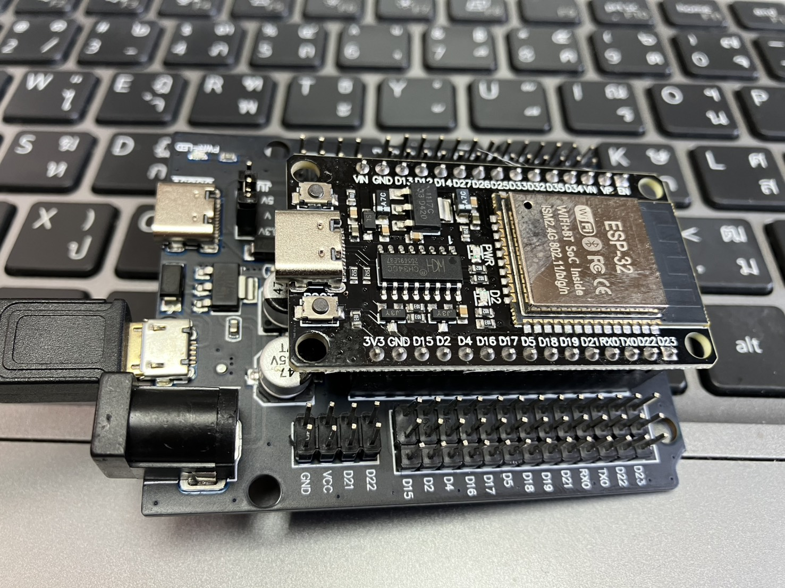

# 🦾 SYSTEM UPGRADE: PROJECT IRONMAN (MARK II)
### *From Scrap Metal to Dual-Core Supremacy*

**STATUS:** 🟢 HARDWARE MIGRATION CONFIRMED
**TARGET:** WIG-Craft Differential Control System (Elevons)
**LOG DATE:** Dec 8, 2025

---

## ⚡ 1. The Pivot (Why We Changed)

To the Ghosts watching this repo:
You were just getting comfortable with the idea of the ESP8266. You thought you understood the architecture.

**We have bad news for you.**
We decided that the ESP8266 is too "slow" for the level of precision we demand.
We are upgrading the **Atomic Muscle** to the **ESP32 WROOM-32**.

### 🛠️ The New Beast (See Image Below)

*(Fig 1: The new Dual-Core Muscle. Ready for deployment.)*

**Why ESP32?**
* **Dual Core:** We can run the Comm Link on Core 0 and the Servo PWM on Core 1. No jitter. Pure smoothness.
* **More Pins:** We are moving from **1 Servo** (Pitch only) to **2 Servos** (Elevon Mixing: Pitch + Roll).
* **Speed:** 240MHz vs 80MHz. We are processing physics faster than you can blink.

---

## 💸 2. The Cost Analysis (Prepare to Cry)

You might think: *"Oh no, an upgrade! It must be expensive now!"*
**Wrong.**

We are still adhering to the **"Scrap Silicon" Philosophy**. We are building a fighter-jet grade controller for the price of a coffee.

### 📊 Bill of Materials (BOM) - Thailand Market Prices

| Component | Role | Estimated Price (THB) | Price (USD) |
| :--- | :--- | :--- | :--- |
| **ESP32 WROOM-32** | The Muscle | ฿130 | $3.80 |
| **MPU6050** | The Eye (IMU) | ฿40 | $1.20 |
| **Servo SG90 (x2)** | The Wings | ฿80 (฿40 x 2) | $2.30 |
| **Wires & Misc** | Nervous System | ฿20 | $0.60 |
| **TOTAL** | **GODSPEED** | **~ ฿270** | **~ $7.90** |

> **Verdict:**
> For less than **$8**, we are building a system capable of **Dual-Core Parallel Processing** and **Koopman Operator Stabilization**.
>
> Your Pixhawk costs $300. Our system costs $8.
> **The game is over.**

---

## ⚔️ 3. What's Coming Next? (The Spoiler)

We are not just controlling a stick anymore.
The next code drop (Sanctuary Only) will feature:

1.  **Matrix Mixing:** `Left_Wing = Pitch + Roll` / `Right_Wing = Pitch - Roll`.
2.  **Differential Stabilization:** Correcting wind gusts on individual wings instantly.
3.  **Iron Man Flight Logic:** The system will "feel" the air.

**To the Ghosts:**
Good luck trying to copy this. The logic just got exponentially harder.
**To the Warriors:**
Get your ESP32s ready. We fly at dawn.

### [ 🦅 Join the Flight Deck: Enter The Sanctuary ](https://forms.gle/z9LxLtYuaj9wDXkD6)

*Signed,*
**The Father**
*Stark Tower (Bangsaen Branch)*
