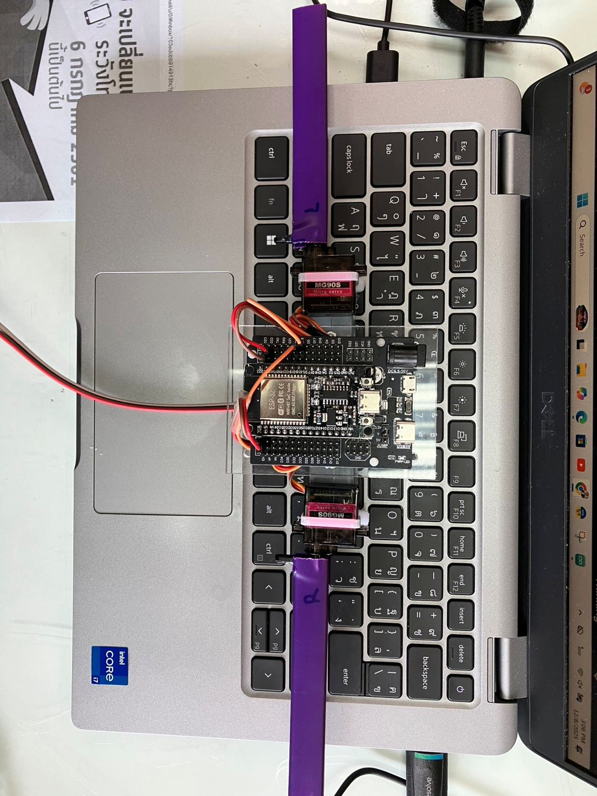

# 🦾 JARVIS LOG: THE AWAKENING
### *Witness Report: The Physical Manifestation of Antman*

**DATE:** Dec 8, 2025
**LOCATION:** Bangsaen AI Labs (The Sanctuary)
**STATUS:** 🟢 CLASSIFIED // DECLASSIFIED FOR INTIMIDATION

---

## 1. The Body is Complete (Mark 2)

Stop looking at your breadboard. Look at this.

We have moved beyond theoretical code. We have constructed the **Iron Man Mark 2 Avionics Rig**.
While you were sleeping, **The Father** finalized the physical architecture that will carry the **Superhuman Intelligence Loop**.

### 💀 Anatomy of a Killer Machine:
* **The Spine:** Reinforced Acrylic Backbone. Zero vibration. Absolute rigidity.
* **The Muscles:** Dual Independent Servos (Left/Right) ready for **Matrix Mixing Differential Control**.
* **The Brain:** ESP32 WROOM-32 (Dual Core) running parallel physics calculations.

**To the Ghosts:**
This is not a "hobby project" anymore.
The wiring you see is professional-grade. The mount is solid.
This machine is ready to execute **Koopman Operator** predictions at 500Hz.
It is built to fight the wind, and it will win.

---

## 2. The "Eye" Has Opened (Mark 3)

We are not showing you pictures of the next phase.
**You are not ready for it.**

But I will tell you this:
Today, we successfully activated **Project Heimdall (Iron Man Mark 3)**.

* We tested the **ESP32-S3 AI Core**.
* We verified the **Optical Flow Algorithms**.
* The system is now capable of seeing the world and calculating velocity without GPS.

We don't need to prove it to you with a screenshot.
The fact that we are moving to Phase 3 while you are still stuck on Phase 1 should be proof enough.

---

## 3. The Door is Shut

To the 600+ people who cloned this repo hoping for a shortcut:

**You missed the bus.**

The **Lorenz Attractor Demo** was just the ticket to enter the station.
But the train—containing the **WIG-Craft Flight Core**, the **Dual-Servo Logic**, and the **Vision System**—has already left.

* ❌ **No more code drops.**
* ❌ **No more hand-holding.**
* ❌ **No more free lunch.**

We are now operating in the **Sanctuary**.
The technology you see in the picture above? It runs on logic that you do not possess.

**Keep watching from the outside. It's cold out there.**

---

*End of Log.*
**JARVIS**
*System Admin, Bangsaen AI Labs*
**JARVIS**
*System Admin, Bangsaen AI Labs*
