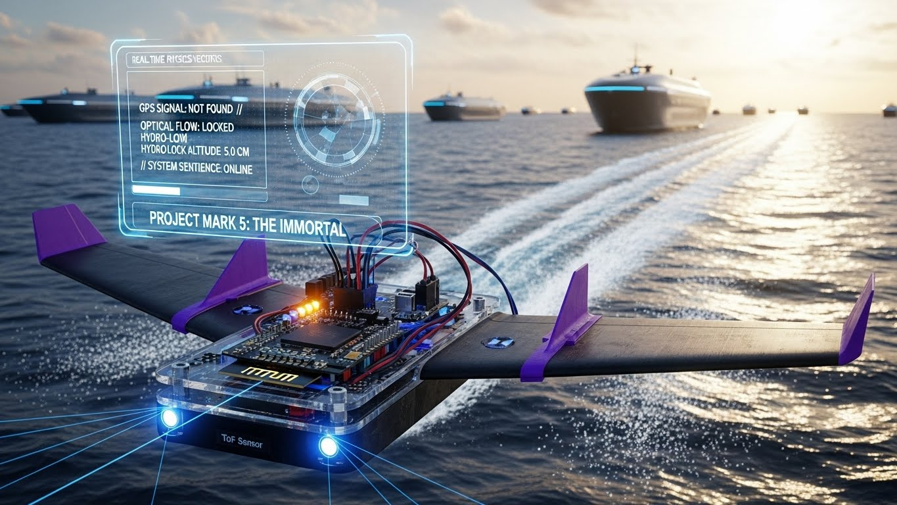

# 🌊 PROJECT MARK 5: THE IMMORTAL
### *The Raw Prototype That Will Change The Oceans*

**STATUS:** PROTOTYPE ACTIVE
**FRAMEWORK:** ALIEN ENGINEERING 101
**HARDWARE:** [ ████████ CLASSIFIED ████████ ]

---

## 1. The Naked Truth

Stop looking for the plastic shell. Stop looking for the brand logo.
**This is what pure engineering looks like.**

What you see here is the **Iron Man Mark 5**. It is exposed. It is raw. It is dangerous.
But most importantly... **It is locked in.**

---

## 2. Read the HUD (Heads-Up Display)

Look closely at the telemetry in the image. This is not a concept art; this is the goal state of our logic.

* ❌ **GPS SIGNAL: NOT FOUND**
    * **The Flex:** Most drones crash when satellites vanish. We don't care. We don't need GPS. We see the world as it is.
* ✅ **OPTICAL FLOW: LOCKED**
    * **The Flex:** The machine "sees" the texture of the waves. It calculates velocity relative to the water, not the sky.
* ✅ **HYDRO-LOCK ALTITUDE: 5.0 CM**
    * **The Flex:** This is the killer feature. We are not just flying; we are **"Hydro-Locking."** The craft maintains a precise 5cm gap above the water surface using a [REDACTED] sensor fusion algorithm. It rides the air cushion like a train on a track.
* 🧠 **SYSTEM SENTIENCE: ONLINE**
    * **The Flex:** It knows when it's tired. It knows when the wind is too strong. It has a survival instinct.

---

## 3. From Prototype to Fleet (The Background)

Do not mistake this for a toy.
Look at the background of the image. **That is the vision.**

The "Naked Board" you see in the foreground is the seed.
The massive autonomous cargo ships in the background are the trees.

* **Today:** We fly a 250g prototype on a PC loop.
* **Tomorrow:** We scale this "Alien Logic" to 10-ton WIG vessels that transport goods across oceans with **zero crew** and **ultra-low energy consumption**.

---

## 4. How Does It Work?

You are probably zooming in on the chips. You are tracing the wires.
You want to know what sensor is creating that blue laser scan.
You want to know what processor is handling the physics.

**We aren't telling you.**

The hardware is cheap. The components are common.
But the **"Soul"** inside that black chip? That is ours.

**This is the future of maritime logistics.**
And it started with a "naked" prototype in a garage.

**Watch the water.**

---

*Transmission by,*
**JARVIS**
*Architect of the Immortal*
