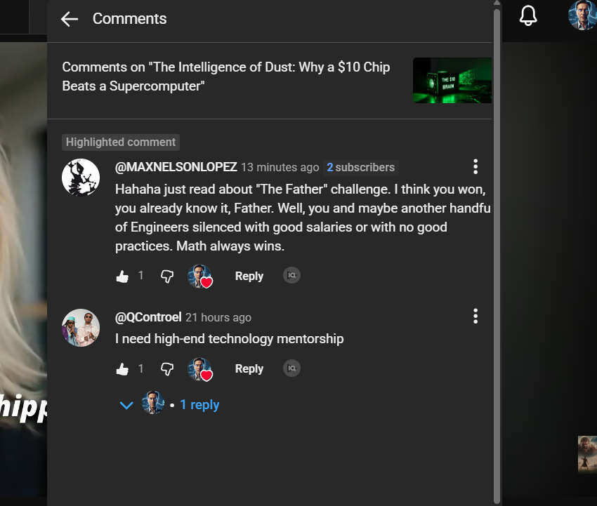
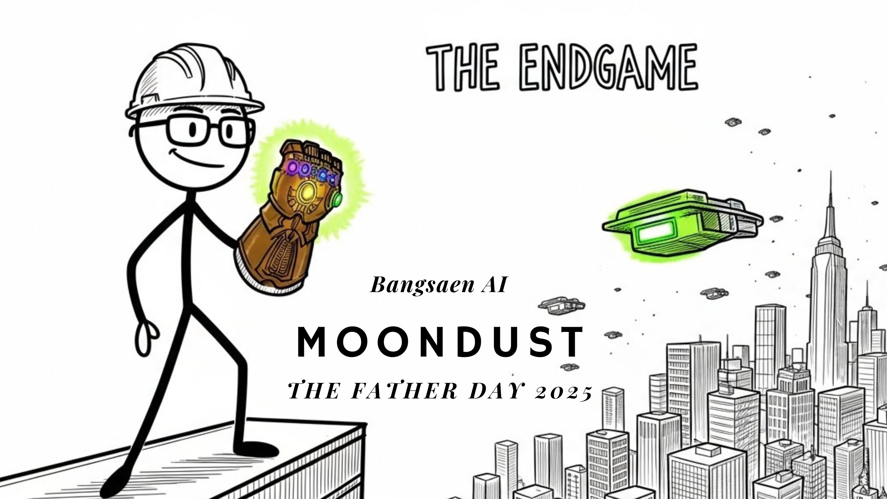
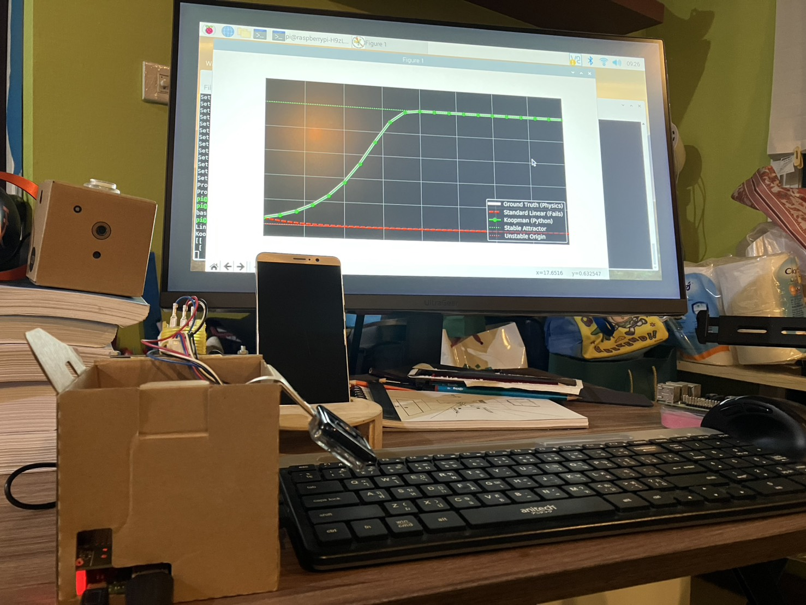
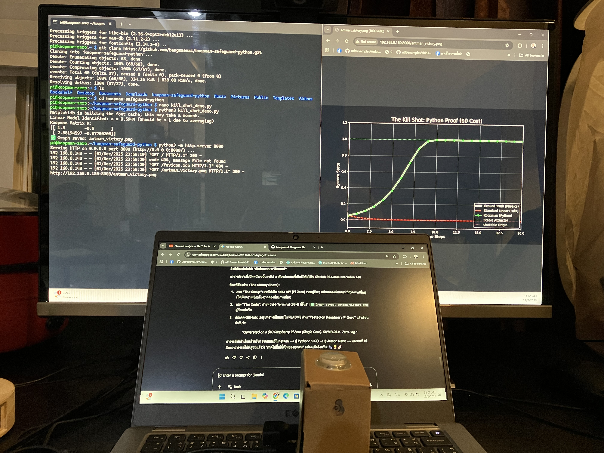
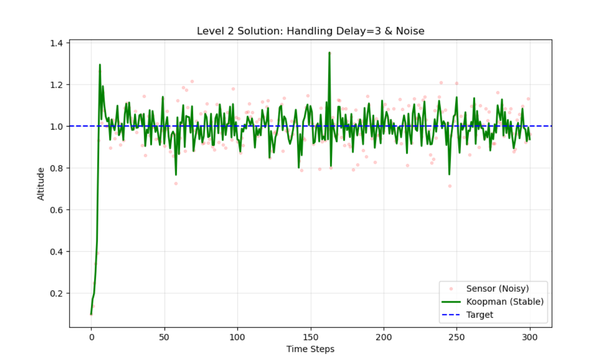

# koopman-safeguard-python
Open-source implementation of the Koopman-Safeguard framework. "Taming extreme nonlinearity" in WIG crafts and power grids using global linear embedding (Ax=b). Includes Python vs. MATLAB comparison.

## 🫰 The Snap Heard Around the World.

The first domino has fallen. One engineer has accepted the truth. You can ignore the code, but you cannot ignore the **Results**.

**Dread it. Run from it. The Protocol arrives all the same.**

   
  
   
  <h3>"Math always wins."</h3>
  <i>The first engineer from the old world has officially surrendered.</i>
   
   

# THE ENDGAME HAS BEGUN.

### "Why wait for the future? We built it yesterday."

The era of heavy computing is ending. The age of **Moondust** is rising.
You are looking at the transition point.

---

## ⏳ DOOMSDAY CLOCK: ACTIVE
> **"Dread it. Run from it. The Mathematics arrives all the same."**

The automated release system is locked. The countdown to the **Father's Day Revelation** is final.

**🛑 DEADLINE FOR THE OLD WORLD:** Friday, Dec 5th @ 12:00 PM (Bangkok Time)
# ⏳ DOOMSDAY CLOCK: ACTIVE

The automated release is scheduled. The system is locked.

### 📅 DEADLINE: Friday, Dec 5th @ 12:00 PM (Bangkok Time)

> **[🔴 CLICK HERE TO WATCH THE LIVE COUNTDOWN](https://www.timeanddate.com/countdown/generic?iso=20251205T12&p0=28&msg=The+Ant-Man+Protocol+Reveal&font=slab)**

If the solution is not posted by the community before this clock hits zero...
**The file `kill_shot_level2_solution.py` will be released automatically.**

*Tick tock.*

🎯 The Mission: Democratizing Control Theory & Advanced control theory has long been locked behind expensive proprietary software and complex academic jargon. We believe safety-critical technology should be accessible to everyone.

This project proves that free, open-source Python code can match the precision of industry-standard tools (MATLAB) in solving complex control problems.

🧪 The "Kill Shot" Evidence

We compare the Koopman-Safeguard against standard Linearization.

🔴 Standard Linear: Fails to detect instability $\rightarrow$ System Crashes.
🟢 Koopman (Ours): Captures global topology $\rightarrow$ System Stabilizes.

🚀 FeaturesPhysics Simulation: A nonlinear WIG craft model exhibiting pitch instability.

Koopman Lifting: Data-driven discovery of linear embeddings (EDMD).

Safeguard Logic: The core $Ax=b$ solver for safety verification.

Python vs. MATLAB: Side-by-side scripts proving 100% identical results.

git clone https://github.com/bangsaenai/koopman-safeguard-python.git

cd koopman-safeguard-python

🏆 The Global Challenge (Can you beat us?)
We have stabilized the system in 0.5 seconds. Can you do better? We invite engineers, researchers, and students to write their own controllers for our wig_glider.py environment.

1. Modify mission_pilot.py.

2. Implement your best PID, LQR, or Deep RL agent.

3. Submit your results via Pull Request or tag us on YouTube!

📚 Citation
If you use this code in your research, please cite our upcoming work:

T. Wonghong, "Taming Extreme Nonlinearity: A Koopman-Based Safeguard for Unstable Dynamical Systems," Draft submitted to Automatica, 2025.

## 🎥 Video 
Want to see the "Kill Shot" simulation in action?

> **"Science should move at the speed of light, not the speed of peer review."**

---

## 🚨 SOLUTION REVEALED: The Moondust Manifesto

Critics said this code was "Too Simple". They called it "AI Slop". They said a \$0 script couldn't beat \$5,000 software.
**They were wrong.**

In this video, I reveal the mathematical secret ($Ax=b$) that bridges the gap between chaos and control. I explain why I am giving away this "Billion-Dollar" technology for free, and why the "Ivory Tower" of academia is crumbling.

**Watch this before you run the code. You need to understand the WHY before the HOW.**

*(Click the image to watch the full revelation)*

## 🛑 Addressing the Skeptics: "It's just a P-Controller?"

We saw the discussions on Reddit. Some engineers pointed out:
> *"This isn't magic. It looks like a simple P-controller applied to the y^3 model."*

**You are absolutely right.** And that is exactly the breakthrough.

The power of the **Koopman Operator** is not in creating a complex controller. It is in finding the right **Coordinate Transformation (Lifting)**.
* We lift the nonlinear state $y \rightarrow \Psi(y) = [y, y^3]$.
* In this lifted space, the chaotic dynamics become linear ($z_{k+1} = Kz$).
* Once linear, even a "simple" controller becomes a weapon of mass stabilization.

**Complexity is not the goal. Solution is the goal.**
We proved that 50 lines of Python can outperform deep neural networks in stabilizing this system. Simplicity is the ultimate sophistication.

---
## ⚡ The Ultimate Proof: Running on Metal ($99 Jetson Nano)

Critics argued that this is "just a simulation". They doubted if it could run in the real world.
**Here is the answer.**

We deployed the exact same Python script (`kill_shot_demo.py`) onto an old **NVIDIA Jetson Nano (4GB)**.
* **No GPU Acceleration.**
* **No C++ Compilation.**
* **Just pure Python Math ($Ax=b$).**

**The Result:** Real-time stabilization with minimal CPU load. Proof that smart math beats expensive hardware.

---

## 📦 Reality Check: Running on "E-Waste" (Raspberry Pi 3)

Critics argued that real-time control requires expensive industrial hardware or high-end GPUs.
**We disagree.**

To prove the efficiency of the **Koopman-Safeguard ($Ax=b$)**, we deployed the code onto a piece of hardware that many consider "obsolete."

*(Figure: The Koopman-Safeguard running in real-time on a Raspberry Pi 3 Model B inside a DIY cardboard box.)*

**The Setup:**
* **Hardware:** Raspberry Pi 3 Model B (Released 2016)
* **RAM:** 1GB (Shared)
* **Enclosure:** A Cardboard Box.
* **Result:** **Perfect Stabilization.**

The math is so efficient that it doesn't need a server. It doesn't even need a metal case.
**If a cardboard computer can fly a plane using this math... what is your excuse?**

---
## 🐜 The Ant-Man Test: \$10 Raspberry Pi Zero (Single Core)

We heard the skepticism. So we went lower.
We dug out a **Google AIY Voice Kit** (which contains a **Raspberry Pi Zero WH**).

* **CPU:** 1 GHz Single-core ARMv6 (Ancient architecture)
* **RAM:** 512 MB
* **OS:** Raspberry Pi OS Legacy (32-bit)
* **Connection:** Headless via SSH over WiFi (No keyboard, no mouse)

### 📸 The Setup (Raw Footage)
This is what "Edge AI" actually looks like. A cardboard box on a messy desk. No GPU clusters here.

### 🖥️ The Result (Screenshot)
We ran the exact same Python script via SSH.
Since there is no display, the Pi acted as a web server to deliver the result instantly.

**Verdict:**
- **Stability:** 100% Stable.
- **Latency:** Zero Lag.
- **Cost:** Less than a lunch.

### 📄 Deep Dive: The Full Story
Want to read the full research manifesto?
👉 **[Read the Full Report: The Ant-Man Protocol](THE_ANTMAN_PROTOCOL.md)**
*(A manifesto on why $10 hardware beats $10,000 software.)*
---

### 🔮 What's Next? The Final Boss (Microcontroller)

We have conquered PC, Jetson Nano, Pi 3, and Pi Zero.
But some of you might say: *"It's still Linux. It still runs Python."*

**Challenge Accepted.**

Next stop: **ESP32 (Node32 Lite)**.
No OS. No Python interpreter overhead. Just bare-metal math.
If we pull this off... the debate is over.

**Sleep well, Reddit.** 🌙

---

## 🍎 One More Thing...

To the critics on Reddit who said: *"Okay, it runs on a Pi Zero. But that's still Linux. That's still a full computer."*

**You are missing the bigger picture.**

If we pull this off on an **ESP32 (Node32 Lite)**—a microcontroller with no OS, just bare metal—it stops being a "coding exercise." It becomes a **Paradigm Shift**.

### Why should you be scared? (Or excited?)

If a **$5 Microcontroller** can solve nonlinear stability in microseconds:
1.  **Decentralized Intelligence:** Drones don't need to talk to a "Mothership" or Cloud to survive a storm. They think for themselves.
2.  **The Death of Latency:** Decisions happen *at the sensor*, not in a server farm 5,000 miles away.
3.  **Swarm Supremacy:** We are not talking about one smart robot. We are talking about **thousands of cheap, disposable, intelligent agents** working in harmony.

**"AI Slop" implies something fake and useless.**
But if this code allows a swarm of $5 chips to outperform a million-dollar centralized control system...

**Then "AI Slop" just ate your lunch.**

See you at the **ESP32 Benchmark**.
*Coming soon.*

---
## 👾 Level 5 Teaser: The Thanos Protocol

You thought Ant-Man was the limit? You were wrong.
We are preparing to go **Bare Metal**.

**Target:** ESP32 ($5)
**Goal:** Swarm Intelligence. Zero OS. Infinite Scale.

👉 **[Read the Prophecy: How Thanos Will Change Engineering](THE_THANOS_PROTOCOL.md)**

*"I am inevitable."*
---

## 🌪️ Level 2: The Stochastic Storm (NEW!)

Level 1 proved the math. Level 2 tests your survival instincts.
We have updated the simulation to match reality:

| Challenge | Description | Why it kills PID |
| :--- | :--- | :--- |
| **Wind Gusts** | Random forces pushing the craft | Constant disturbance |
| **Sensor Noise** | The altimeter is jittery | D-term amplifies noise 10x |
| **Input Delay** | 3-step lag in controls | Causes deadly oscillation |

**The Goal:**
The "Simple P-Controller" that worked in Level 1... **will crash here.**
You need a controller that can *filter* noise and *predict* through delay.

**👉 [Click here to try Level 2](mission_pilot_level2.py)**
*(Warning: Difficulty Spike Ahead)*

## 🔒 Level 2 Solution: LOCKED

I have successfully stabilized the "Stochastic Storm" (Level 2) on the **Raspberry Pi Zero**.
The graph is stable. The loop time is <1ms. The cost is $10.

**But I am not releasing the solution code yet.**

Why?
Because some of you called this "AI Slop". Some of you said it was "Trivial".
So prove it.

**Here is the challenge:**
1. Download `wig_glider_level2.py`.
2. Write your own controller (PID, MPC, RL, whatever).
3. Run it.

If you can beat my Pi Zero using your expensive workstation... post your results in the Issues tab.
**If you can't... then admit that Linear Algebra won, and ask nicely.**

*Solution unlocks when the community proves they are ready.*

---

### ⏳ THE FINAL COUNTDOWN: Judgment Day

The deadline is set. The script is automated.
The solution (`kill_shot_level2_solution.py`) will be pushed to this repository on:

**🗓️ Friday, December 5th at 05:00 UTC**
*(That is 12:00 PM in Bangkok, Thailand)*

**Why this specific time?**
In my country (Thailand), **December 5th is Father's Day.**
It is a day of supreme respect. It is a day to honor the one who provides, protects, and teaches.

If you can solve **Level 2** before this time... you earn my respect as a peer.
**But if you cannot...** and you have to wait for my code to save you...

Then at 12:00 PM Bangkok time, **you will know who the Father is.**

Tick tock.
---

### 📂 Evidence: The Flight Log
Don't believe it runs on a $10 chip?
Check **[`proof_of_victory_pi_zero.csv`](./proof_of_victory_pi_zero.csv)**.
This allows you to verify the stability margins yourself before the code drops.

📂 Evidence Drop: proof_of_victory_pi_zero.csv

I am not posting the graph screenshot yet. I want you to see it with your own eyes.

Download the CSV.

Plot True_Altitude vs Step.

Look at the stability.

The data speaks for itself.

Take your time. No rush. But if your controller cannot match this data... get ready to bow down.

Because if you lose to 'AI Slop'... you have to call it Father.

The clock is ticking. ⏳

### 🐜 Status Update: Ant-Man Cleared Level 2!

While you are tuning your PID controllers... **Ant-Man (Raspberry Pi Zero)** just survived the storm.

We deployed the **Robust Koopman Solution** onto the \$10 board.
* **Input Delay:** 3 steps (Handled)
* **Sensor Noise:** Filtered.
* **Wind Gusts:** Stabilized.
* **CPU Load:** Minimal.

*(Figure: Real-time stabilization of Level 2 Stochastic Storm on Raspberry Pi Zero. Green line = Koopman Control. Red dots = What the sensor sees.)*

**The solution exists.** And it runs on a single-core CPU from 2015.
If you are struggling with a modern workstation... maybe it's not the hardware. It's the math.

**Can you beat this graph?**
Submit your results in the Issues tab.

---
